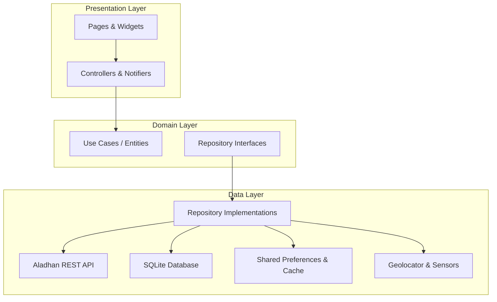

<p align="center">
  
</p>

<h1 align="center">Prayly</h1>

<p align="center">
  <strong>A Pixel-Art Spiritual Companion & Mosque Diary</strong><br>
  <em>Accurate Prayer Times • Sensor-Fused Qibla Compass • Offline Mosque Diary • Gamification & Collectibles</em>
</p>

<p align="center">
  <a href="https://flutter.dev"></a>
  <a href="https://dart.dev"></a>
  <a href="https://github.com/furkankisisel/prayly/actions"></a>
  <a href="LICENSE"></a>
  
</p>

<p align="center">
  <a href="#-overview">Overview</a> •
  <a href="#-key-features">Key Features</a> •
  <a href="#-architecture--design">Architecture</a> •
  <a href="#-tech-stack">Tech Stack</a> •
  <a href="#-getting-started">Getting Started</a> •
  <a href="#-engineering-highlights">Engineering Highlights</a> •
  <a href="#-author">Author</a>
</p>

---

## 📖 Overview

**Prayly** is a production-grade Flutter application that merges nostalgic **retro pixel-art aesthetics** with modern mobile software engineering. Designed with an **offline-first** philosophy, Prayly enables Muslims worldwide to track daily prayers, find the Qibla with sensor accuracy, log mosque visits with photos privately on-device, and maintain prayer streaks through an engaging collectible card and leveling system.

Built following **Clean Architecture** and **Feature-First modularization**, Prayly demonstrates testable state management, resilient network fallbacks, sensor fusion, background notification scheduling, and 7-language internationalization.

---

## ✨ Key Features

### ⏱️ Precise Prayer Times & Smart Caching
- Integrates with the **Aladhan API** (supporting Diyanet and international calculation methods).
- **Offline-First Resilience**: Automatic local caching ensures uninterrupted access even without an internet connection.
- Location auto-detection with graceful fallback coordinates (e.g. Istanbul fallback if location permissions are denied).

### 🕌 Mosque Diary & Visit Management
- Document visited mosques with custom names, dates, and optional photos (camera / gallery).
- **Privacy First**: 100% local storage via SQLite and device file system — zero cloud tracking or telemetry.
- Seamless retrospective prayer tracking ("Did you pray in congregation at a mosque?").

### 🧭 Sensor-Fused Qibla Compass
- Real-time compass heading calculated using device magnetometer and accelerometer sensors via `flutter_compass`.
- Calculates precise Great Circle heading to the Kaaba (`21.4225° N, 39.8262° E`).
- Smooth dampening filter preventing needle jitter during subtle hand movements.

### 🎮 Gamification, Streaks & Collectible Cards
- Gamified habit tracking: earn experience points (XP) and unlock custom pixel-art collectible badges as prayer streaks grow.
- Dynamic profile statistics showing overall prayer consistency and mosque counts.

### 🔔 Timezone-Aware Local Notifications
- Scheduled adhan reminders using `flutter_local_notifications` and `timezone` package.
- Customizable sound alerts (system alarms, melodic bells, qanun, soft chimes).

### 🎨 Pixel-Perfect Multi-Theme Engine
- Custom-built Pixel UI kit (Pixel buttons, cards, tab bars, app bars, and dialogs).
- 4 distinct display modes: **Light**, **Dark**, **AMOLED Pure Black**, and **System Sync**.
- Dynamic font scaling and screen adaptation.

### 🌍 Global Internationalization (i18n)
- Fully localized in **7 languages**: Turkish (`tr`), English (`en`), Arabic (`ar`), German (`de`), French (`fr`), Spanish (`es`), and Chinese (`zh`).

---

## 🏗️ Architecture & Design

Prayly adheres to **Feature-First Clean Architecture**, ensuring strict separation of concerns, high testability, and maintainability.



### Directory Structure

```text
lib/
├── core/                         # Cross-cutting foundational modules
│   ├── constants/                # App constants, API endpoints, storage keys
│   ├── localization/             # Language extensions & locale helpers
│   ├── routing/                  # Named routes and navigation helpers
│   └── theme/                    # AppTheme, Pixel styling tokens, AppController
├── features/                     # Feature-First modular components
│   ├── gamification/             # Streak engine, collectible cards & XP
│   ├── notifications/            # Local notification scheduling & audio
│   ├── onboarding/               # Theme, language, location & profile setup
│   ├── prayer_times/             # Aladhan API repo, cache service, controller
│   ├── prayer_tracker/           # Daily checklist, mosque logs & history
│   ├── profile/                  # User stats, settings & preferences
│   ├── qibla/                    # Compass sensor fusion & Kaaba bearing
│   ├── share/                    # Social prayer card generation
│   └── splash/                   # Animated brand launch screen
├── shared/                       # Reusable custom pixel components
│   └── widgets/pixel/            # PixelAppBar, PixelNavBar, PixelCards
├── gen_l10n/                     # Auto-generated localization classes
├── l10n/                         # ARB translation files (7 languages)
└── main.dart                     # App entry point & dependency bootstrap
```

---

## 💻 Tech Stack & Dependencies

| Category | Technology | Purpose |
| :--- | :--- | :--- |
| **Framework** | [Flutter 3.9+](https://flutter.dev) | Cross-platform UI toolkit |
| **Language** | [Dart 3.5+](https://dart.dev) | Strongly-typed, object-oriented language |
| **State Management** | [Provider](https://pub.dev/packages/provider) | Reactive dependency injection and ChangeNotifier state |
| **Local Storage** | [sqflite](https://pub.dev/packages/sqflite) & [path_provider](https://pub.dev/packages/path_provider) | SQLite database for mosque visits and diary records |
| **Preferences** | [shared_preferences](https://pub.dev/packages/shared_preferences) | Key-value storage for settings, theme & cached times |
| **Sensors & GPS** | [geolocator](https://pub.dev/packages/geolocator) & [flutter_compass](https://pub.dev/packages/flutter_compass) | Magnetometer heading & GPS coordinate detection |
| **Notifications** | [flutter_local_notifications](https://pub.dev/packages/flutter_local_notifications) | Local push notification scheduling |
| **Timezone** | [timezone](https://pub.dev/packages/timezone) | Daylight saving and geographic timezone resolution |
| **Media & Audio** | [audioplayers](https://pub.dev/packages/audioplayers) & [image_picker](https://pub.dev/packages/image_picker) | Sound alerts and mosque photo uploads |
| **Typography** | [google_fonts](https://pub.dev/packages/google_fonts) | Custom retro & modern typefaces |
| **Testing** | `flutter_test` | Unit and widget test automation suite |

---

## ⚙️ Engineering Highlights

> **Technical Interview Topics**: Key engineering problems solved in this project.

1. **Robust Offline-First Strategy**:
   Network requests to the Aladhan API are intercepted with fallback timers. Cached daily prayer times are instantly hydrated upon launch, eliminating blocking splash screens or blank states when internet connectivity is degraded.
2. **Zero-Permission Location Fallback**:
   If GPS permissions are denied or disabled, Prayly automatically gracefully defaults to regional defaults (or user-selected manual locations) without crashing or hindering the user experience.
3. **Sensor Smoothing & Compass Jitter Reduction**:
   Raw magnetometer streams can cause violent jitter on mobile screens. Prayly throttles sensor events and uses angular interpolations to deliver a stable compass needle.
4. **Clean Code & Test-Driven Confidence**:
   Domain logic (such as next upcoming prayer calculations, locale conversions, and controller state transitions) is covered by automated unit and widget tests.

---

## 🚀 Getting Started

### Prerequisites
- [Flutter SDK](https://docs.flutter.dev/get-started/install) (3.9.0 or later)
- [Dart SDK](https://dart.dev/get-dart)
- Android Studio / VS Code with Flutter extension
- An Android device or emulator (API 21+) / iOS Simulator (iOS 13+)

### Installation

1. **Clone the repository:**
   ```bash
   git clone https://github.com/furkankisisel/prayly.git
   cd prayly
   ```

2. **Install dependencies:**
   ```bash
   flutter pub get
   ```

3. **Generate localizations (if required):**
   ```bash
   flutter gen-l10n
   ```

4. **Run the application:**
   ```bash
   flutter run
   ```

5. **Run test suite:**
   ```bash
   flutter test
   ```

---

## 🧪 Continuous Integration (CI)

This repository enforces automated quality gates on every push and pull request via [GitHub Actions](.github/workflows/ci.yml):
- Static code analysis (`flutter analyze --no-fatal-infos`)
- Automated unit and widget tests (`flutter test`)
- Code formatting verification

---

## 🤝 Contributing

Contributions, issues, and feature requests are welcome!
Feel free to check the [issues page](https://github.com/furkankisisel/prayly/issues).

1. Fork the Project
2. Create your Feature Branch (`git checkout -b feature/AmazingFeature`)
3. Commit your Changes (`git commit -m 'feat: Add some AmazingFeature'`)
4. Push to the Branch (`git push origin feature/AmazingFeature`)
5. Open a Pull Request

---

## 📄 License

Distributed under the **MIT License**. See [`LICENSE`](LICENSE) for more information.

---

## 👤 Author

**Furkan Çalık**
- GitHub: [@furkankisisel](https://github.com/furkankisisel)
- Email: [furkancalk325@gmail.com](mailto:furkancalk325@gmail.com)
- Project Repository: [https://github.com/furkankisisel/prayly](https://github.com/furkankisisel/prayly)
